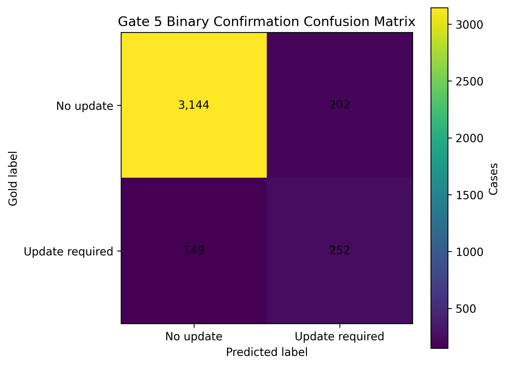
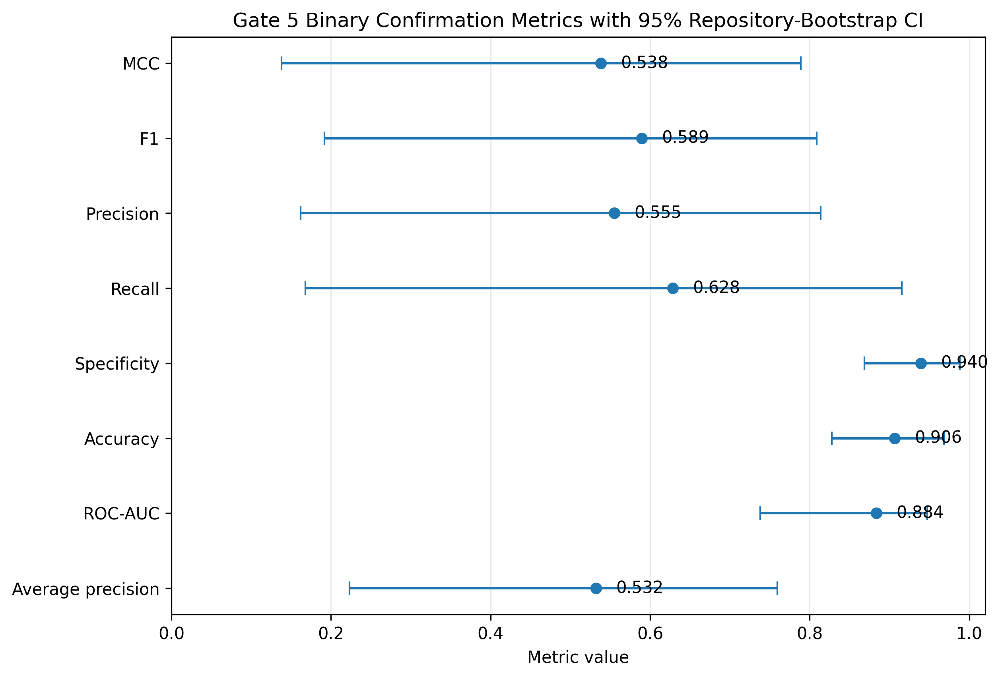
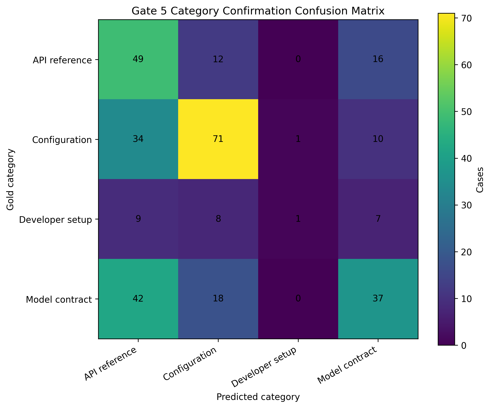
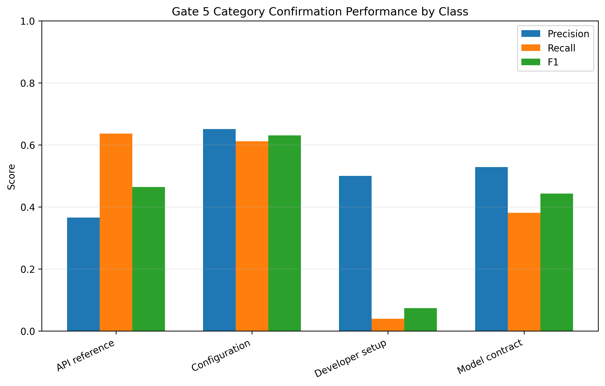
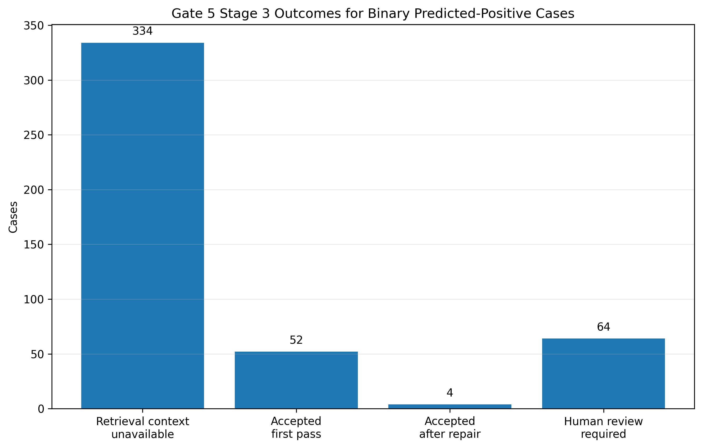
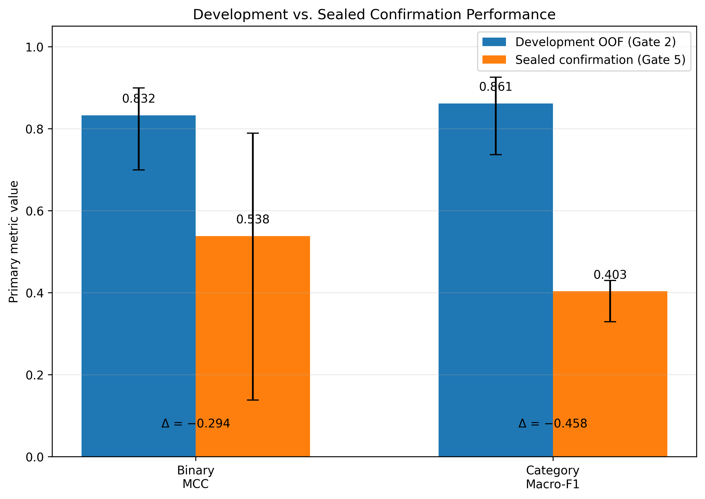

# Gate 5 — One-Shot Confirmation Final Report

## Status

**COMPLETED — ONE SHOT ONLY.**

The frozen confirmation dataset was evaluated exactly under the preregistered
Gate 5 protocol. The master receipt was written last and explicitly records
`rerun_allowed=false`. No post-confirmation tuning is permitted.

- Execution commit: `88e185a637f11204a1af7b2a6ad2eddc6032e30f`
- Confirmation rows: `3747`
- Confirmation SHA-256: `e73caca3b9ef46de284c4755127e3d7cfc0b5db9f3d1c8cd2b85be80b2c6d01b`
- Return archive SHA-256: `bc57c02eba812152713116e978add4c1181d8a741b6a7ed717bd5d4796ea8126`

## Binary classifier

Primary preregistered confirmation metric:

- **MCC: 0.5382**
- Repository-bootstrap 95% CI:
  **[0.1379, 0.7887]**

Additional metrics:

| Metric | Value |
|---|---:|
| Accuracy | 0.9063 |
| Balanced accuracy | 0.7840 |
| Precision | 0.5551 |
| Recall | 0.6284 |
| F1 | 0.5895 |
| Specificity | 0.9396 |
| ROC-AUC | 0.8836 |
| Average precision | 0.5324 |

Confusion matrix:

- TN = 3144
- FP = 202
- FN = 149
- TP = 252

## Category classifier

The intrinsic category evaluation contains **315**
category-eligible confirmation examples.

Primary preregistered metric:

- **Macro-F1: 0.4032**
- Repository-bootstrap 95% CI:
  **[0.3292, 0.4294]**

Additional metrics:

| Metric | Value |
|---|---:|
| Accuracy | 0.5016 |
| Balanced accuracy | 0.4175 |
| Weighted F1 | 0.4883 |

Per-class F1:

| Category | F1 |
|---|---:|
| API reference | 0.4645 |
| Configuration | 0.6311 |
| Developer setup | 0.0741 |
| Model contract | 0.4431 |

## Stage 3 confirmation execution

The frozen Binary model predicted **454** of
3747 confirmation cases as positive.

- Retrieval context available: **120**
  (26.4% of predicted positives)
- Retrieval context unavailable: **334**
- Accepted first pass: **52**
- Accepted after repair: **4**
- Total pipeline-accepted with context: **56/120**
  (46.7%)
- Human review required: **64**
- LLM calls: **153**

Execution errors:

- Input token budget exceeded:
  **50**
- Invalid structured LLM output:
  **6**

Safety violations:

- Empty patch:
  **3**
- Target not retrieved:
  **14**
- Unsupported fact:
  **17**

## Development-to-confirmation generalization gap

The selected M1 classifier families showed substantially stronger
development-only repository-grouped OOF performance than on the sealed
one-shot confirmation set.

| Task | Development OOF | Sealed confirmation | Absolute change |
|---|---:|---:|---:|
| Binary MCC | 0.8321 | 0.5382 | -0.2940 |
| Category Macro-F1 | 0.8610 | 0.4032 | -0.4578 |

The observed change is **descriptive evidence of a generalization/domain
shift**, not a basis for further model selection or tuning. Gate 2 already
showed that aggregate development performance was materially influenced by
controlled-design examples and that natural-case slices were substantially
harder.

## Interpretation

The confirmation results demonstrate a meaningful generalization gap relative
to development-only model-selection evidence. The Binary classifier retains
useful discrimination on the sealed confirmation set, but performance is
materially lower than development estimates. Category classification shows a
larger drop, with especially weak performance for `developer_setup`.

These confirmation results are final evidence and **must not be used to
re-tune or re-select the frozen models**.

Stage 3 results above describe retrieval availability and automatic
structured/safety acceptance. They are **not a human semantic-quality score**.
The preregistered post-confirmation human/reference evaluation is performed
separately in Gate 6.

## Gate 5 disposition

- Confirmation evaluated: **yes**
- Master receipt present: **yes**
- Rerun permitted: **no**
- Post-confirmation tuning: **no**
- Gate 6 human/reference evaluation still required: **yes**
