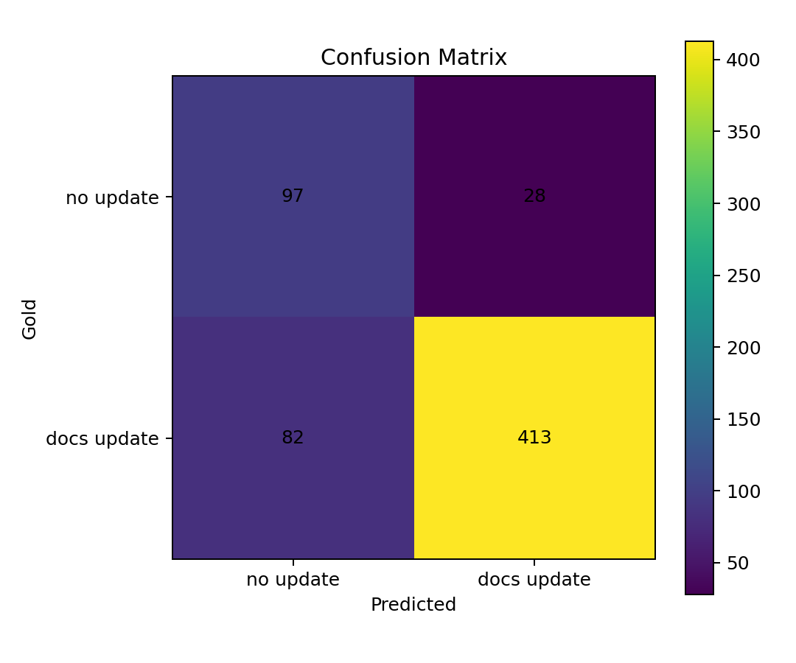
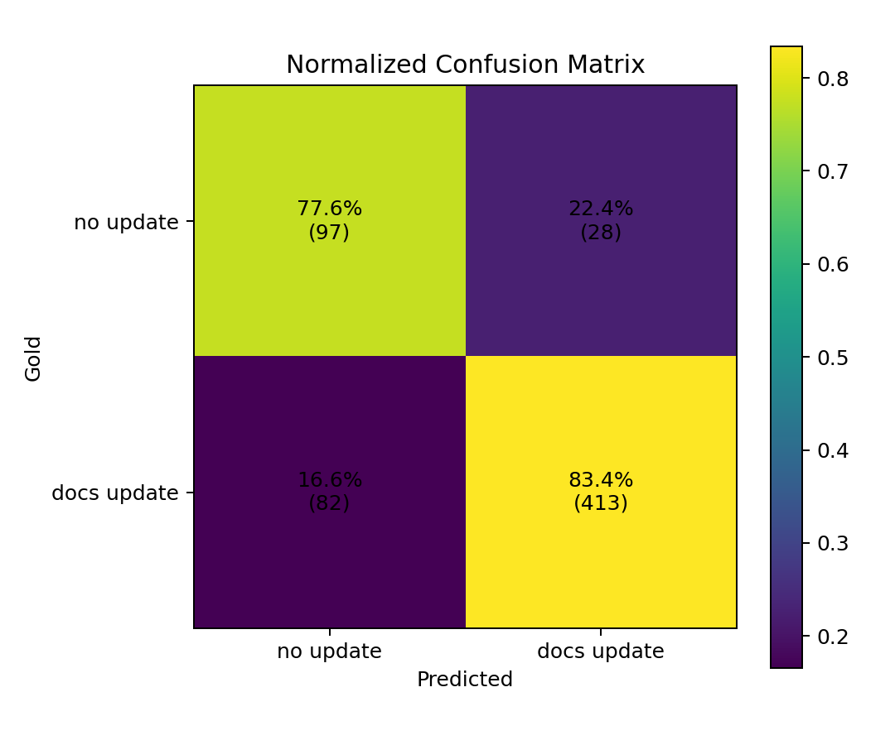
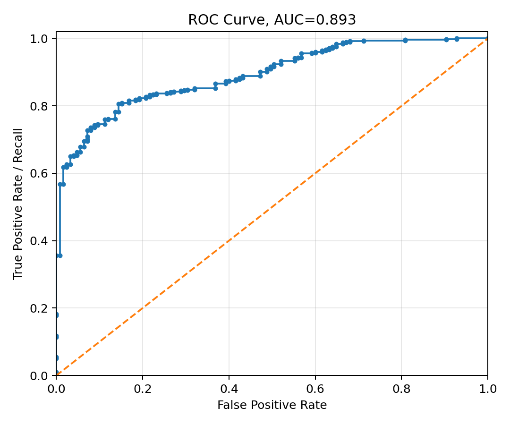
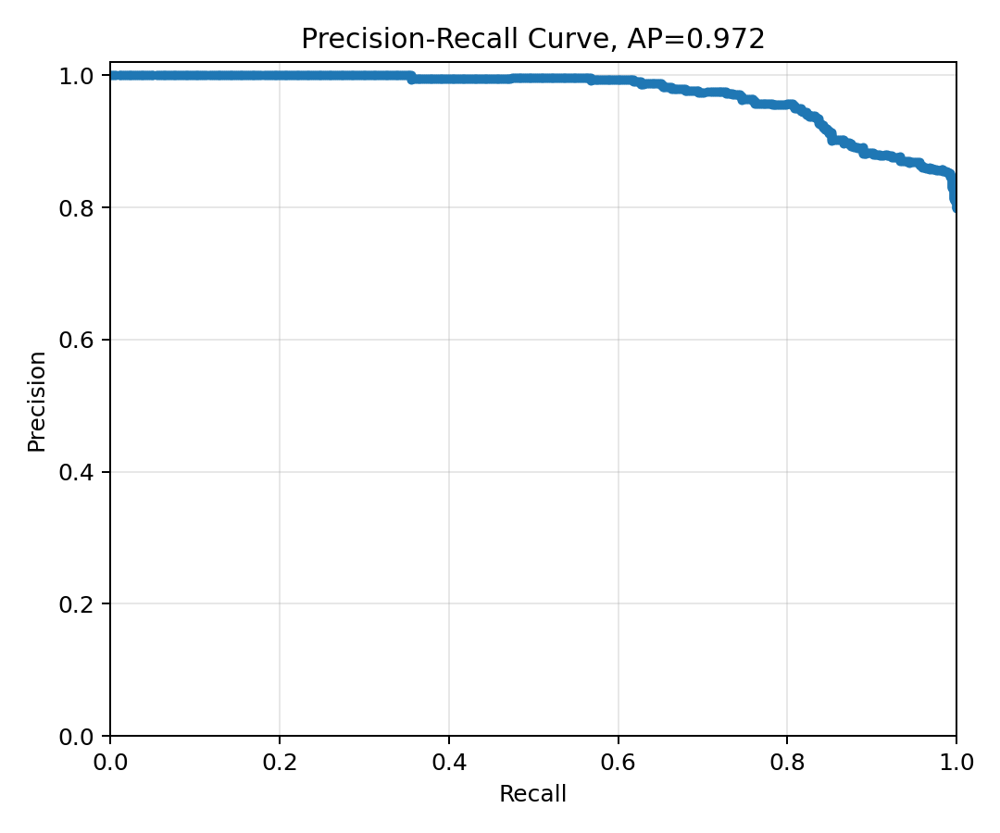
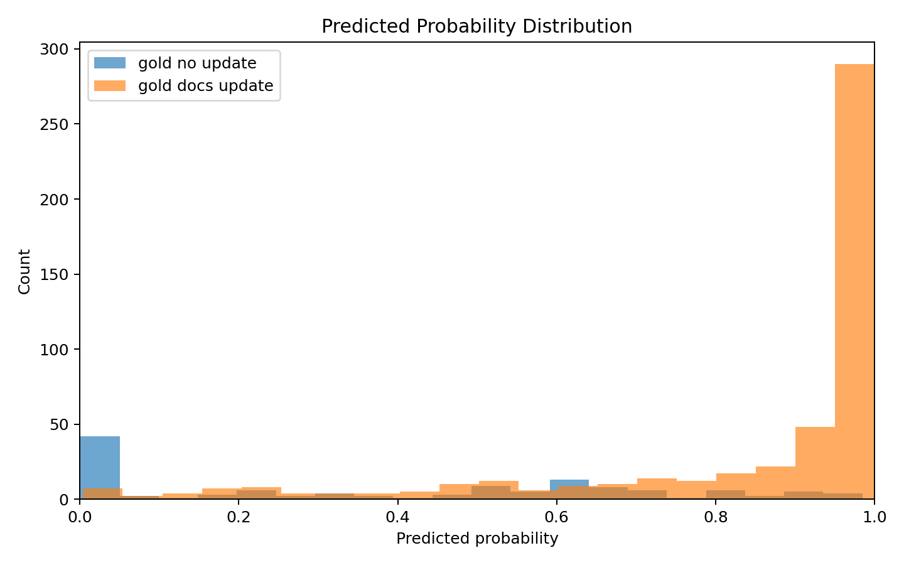
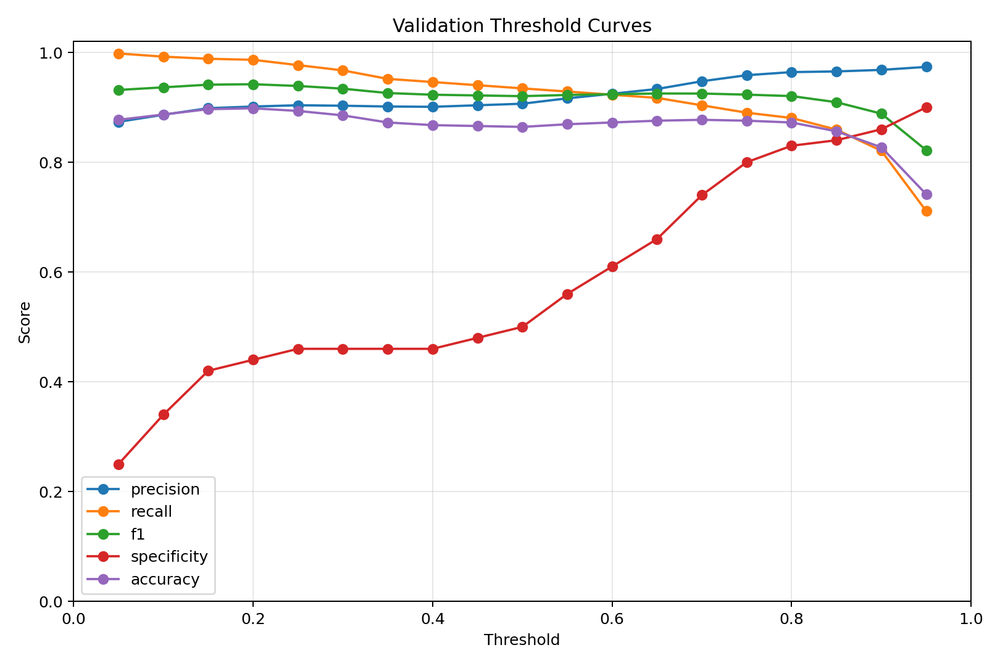
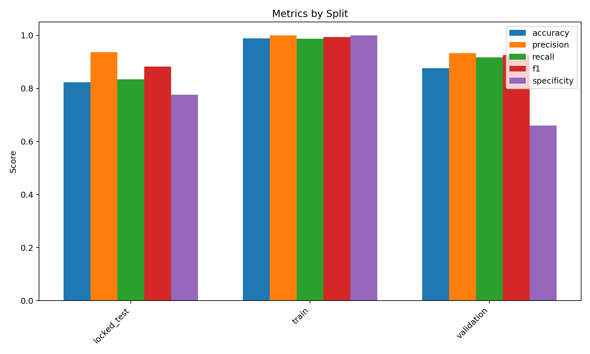
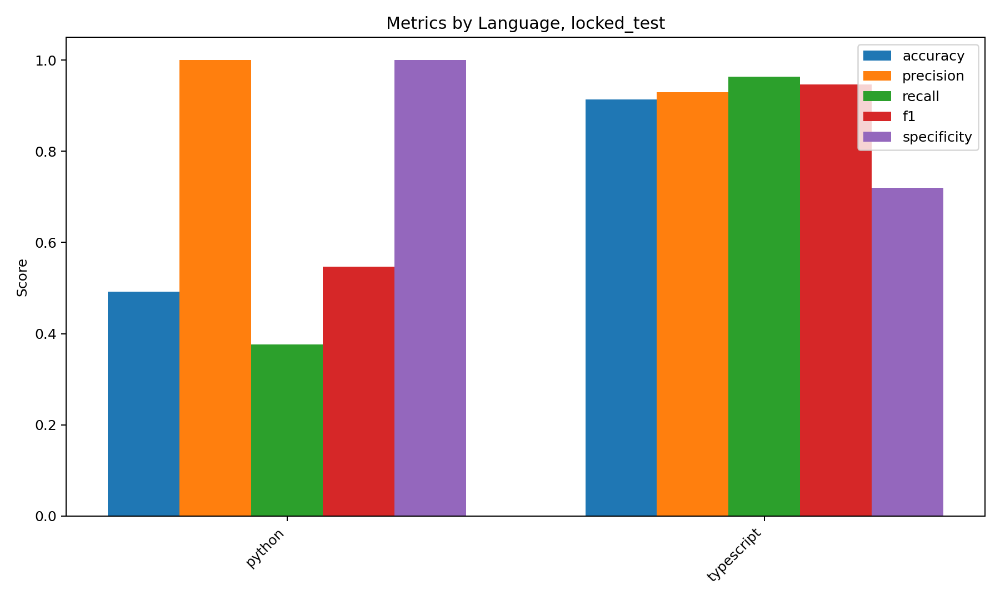
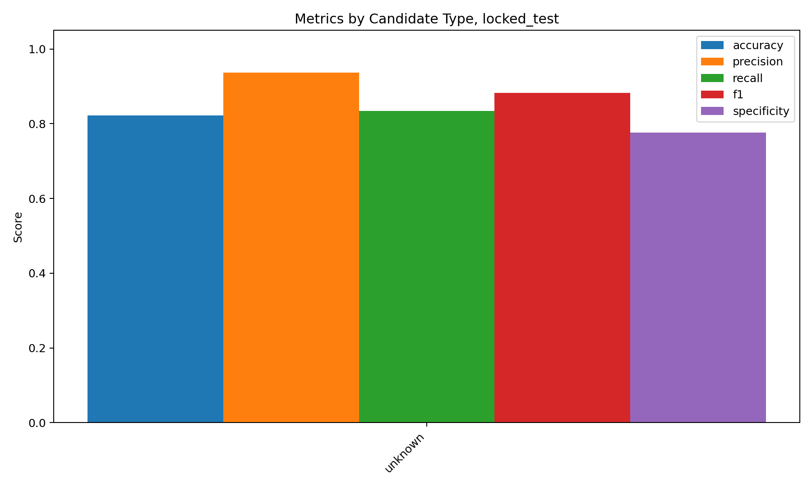

# Real Case Study Evaluation Figures

This report visualizes real GitHub PR classifier predictions.

## Summary

- Prediction file: `reports\real_case_study\generated\real_gold_classifier_4k_v3_strict_raw\best_model_predictions.jsonl`
- Primary split: `locked_test`
- Primary cases: `620`
- Accuracy: `0.8226`
- Precision: `0.9365`
- Recall: `0.8343`
- F1: `0.8825`
- Specificity: `0.7760`
- ROC AUC: `0.8927`
- Average precision: `0.9720`

## Figures

### confusion_matrix_locked_test

### confusion_matrix_locked_test_normalized

### roc_curve_locked_test

### precision_recall_curve_locked_test

### probability_distribution_locked_test

### threshold_metrics_curve_validation

### metrics_by_split

### metrics_by_language_locked_test

### metrics_by_candidate_type_locked_test

